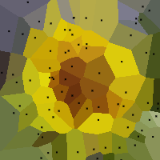

# Voronoi Image Converter
before | after
--- | ---
 | 

Converts user-provided image to a Voronoi diagram

## Live demo
You can see live demo [here](https://konradlinkowski.github.io/Voronoi/)

## Installation
Just clone the repo and open [index.html](index.html) using a file server
